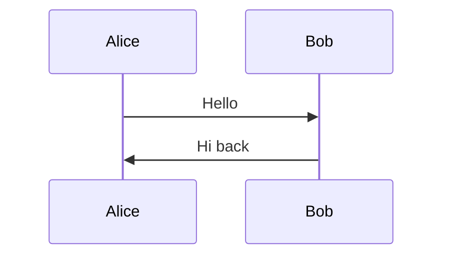

# Инструкция по работе с блогом

Hugo + [PaperModX](https://github.com/reorx/hugo-PaperModX), Nord-палитра, деплой через GitHub Pages.

## Структура контента

Двуязычный сайт (`ru` + `en`). Посты лежат в:

```
content/ru/posts/YYYY-MM-DD-slug.md
content/en/posts/YYYY-MM-DD-slug.md
```

`en` — основная локаль. Когда переводите русский пост на английский,
кладите его в `content/en/posts/` с тем же `slug` и `date` — Hugo
свяжет переводы через `RelPermalink`.

Служебные страницы (на каждую локаль):

```
content/ru/{search.md, archives.md, about/index.md}
content/en/{search.md, archives.md, about/index.md}
```

## Frontmatter поста

```yaml
---
title: "Заголовок статьи"
date: 2026-05-20
description: "Краткое описание для OG/Twitter и превью на главной."
tags:
  - Kotlin
  - Flow
---
```

Поля:

- `title` — обязательно, в кавычках.
- `date` — обязательно, формат `YYYY-MM-DD`. Имя файла должно совпадать с датой.
- `description` — обязательно. Используется в OG, Twitter Card, превью на главной, поиске.
- `tags` — опционально. Латиницей для согласованности (даже в русских постах).

Тема автоматически добавляет: `ShowToc` (TOC справа от 1440px), `ShowCodeCopyButtons`,
`ShowReadingTime`, `ShowPostNavLinks`, `ShowBreadCrumbs` — управляются глобально
через `hugo.toml`, переопределить в конкретном посте можно через frontmatter.

## Превью на главной

Превью — `description`, если задан. Чтобы задать границу вручную, используйте
разделитель `<!--more-->`. Описание при этом продолжает работать.

```markdown
Этот текст будет показан как превью на главной странице.

<!--more-->

Этот текст виден только внутри статьи.
```

## Mermaid-диаграммы

Блок ` ```mermaid ` автоматически превращается в SVG-диаграмму в браузере.
Дополнительных настроек в frontmatter не нужно — partial подключается
только на страницах, где есть mermaid-блок.

````markdown

````

Поддерживаются все стандартные типы: `flowchart`, `sequenceDiagram`,
`classDiagram`, `stateDiagram`, `erDiagram`, `gantt`, `pie`, `gitGraph`.

## Локальный просмотр

```bash
hugo server
```

Открыть в браузере: http://localhost:1313/

Сервер следит за изменениями и перезагружает страницу автоматически.
Остановить: `Ctrl+C`.

## Сборка

```bash
hugo --minify
```

Результат — в `public/`. Не коммитится (добавлено в `.gitignore`).

## Деплой на GitHub Pages

Автоматически через GitHub Actions: любой push в `master` собирает сайт
и публикует на https://galiulin.github.io.

Конфиг workflow: `.github/workflows/hugo.yml`. Шаг `actions/checkout@v4`
обязательно с `submodules: recursive` — без этого PaperModX не
подтянется при сборке.

Статус деплоя: https://github.com/galiulin/galiulin.github.io/actions

### Первоначальная настройка (один раз)

В настройках репозитория: **Settings → Pages → Source → GitHub Actions**.

## Перекраска и шрифты

Палитра Nord + chroma-цвета кода — в `assets/css/extended/custom.css`.
Тема подключает всё из `assets/css/extended/*.css` автоматически.

Шрифты системные (`-apple-system`, …) для UI и моно-стек с JetBrains
Mono / Fira Code в приоритете для кода. Если хочется подключить
локальные шрифты — положите их в `static/fonts/` и добавьте `@font-face`
в `assets/css/extended/custom.css`.

## Полезные ссылки

- Hugo docs: https://gohugo.io/documentation/
- PaperModX docs: https://reorx.github.io/hugo-PaperModX/
- Nord palette: https://www.nordtheme.com/
- Mermaid docs: https://mermaid.js.org/

## План миграции

Исторический план переезда с кастомной темы `sand` на PaperModX —
в `MIGRATION.md`.