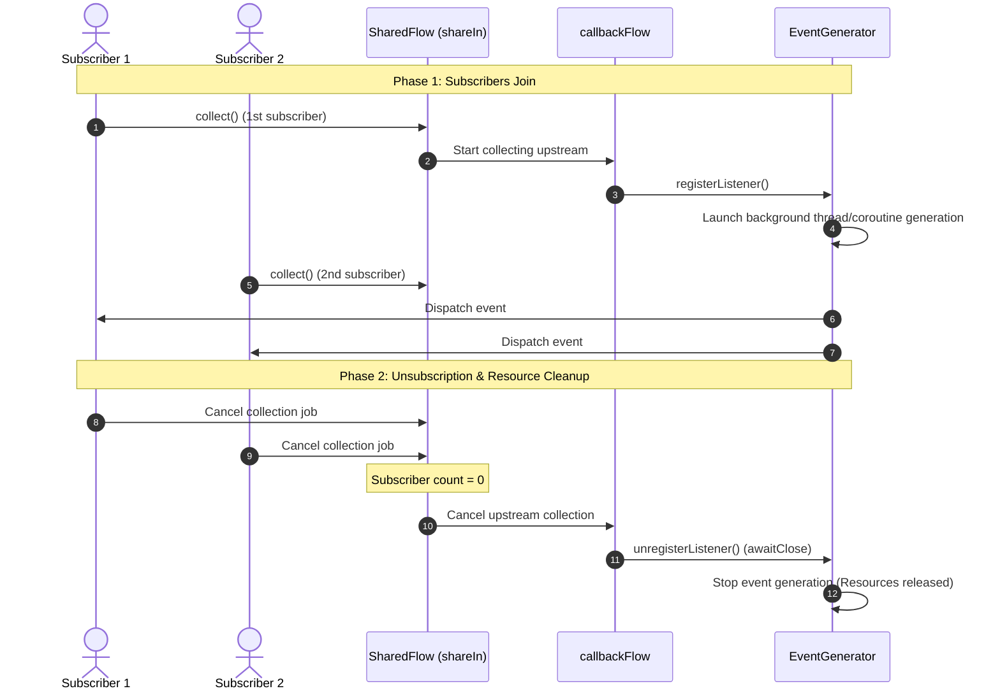

# Reactive Stream Lifecycle Management: From Callback API to SharedFlow with Auto-Subscription

In modern Android and JVM development, reactive programming based on Kotlin Coroutines and Flow is the gold standard. However, developers frequently encounter traditional Callback interfaces (event listeners) or need to share a single stream of data among multiple subscribers while enforcing strict resource control.

In this article, we'll dive deep into how to bind an asynchronous callback-based event generator, wrap it in a `callbackFlow`, convert it into a hot `SharedFlow` using the `WhileSubscribed` strategy, and manage subscription lifecycles so that resources are only allocated when active listeners are present.

---

## Architectural Goal

Imagine a system that generates events (e.g., GPS coordinates, network socket packets, or hardware sensor readings). We want to:
1. Wrap this traditional event source into a reactive `Flow`.
2. Allow multiple subscribers to listen to the exact same event stream simultaneously (**SharedFlow**).
3. Prevent resource leaks: if there are no active subscribers (everyone unsubscribes), the event generator must be fully stopped.
4. Auto-restart: when a subscriber connects again, the event generator must automatically resume operation.

To achieve this in Kotlin, we combine two powerful APIs:
* **`callbackFlow`** — a bridge between callback-based APIs and reactive streams.
* **`SharingStarted.WhileSubscribed`** — a strategy that manages the active lifespan of a hot flow based on the number of active collectors.

---

## Sequence Diagram



---

## Full Kotlin Implementation

Here is a ready-to-run Kotlin implementation. For visual demonstration clarity, we use a scalable timeline of 10 seconds (in a real-world scenario, you can easily change this to 60 seconds or any duration).

```kotlin
import kotlinx.coroutines.*
import kotlinx.coroutines.channels.awaitClose
import kotlinx.coroutines.flow.*
import java.time.LocalTime
import java.time.format.DateTimeFormatter

// Logger helper utility with precise timestamps
fun log(message: String) {
    val time = LocalTime.now().format(DateTimeFormatter.ofPattern("HH:mm:ss.SSS"))
    println("[$time] $message")
}

// 1. Traditional listener interface
interface EventListener {
    fun onEvent(event: String)
}

// 2. Event generator wrapper (emulates external callback-based source)
class EventGenerator(private val scope: CoroutineScope) {
    private val listeners = mutableListOf<EventListener>()
    private var job: Job? = null
    private var eventCounter = 1

    @Synchronized
    fun registerListener(listener: EventListener) {
        listeners.add(listener)
        log("[EventGenerator] Listener registered. Active listeners: ${listeners.size}")
        if (job == null) {
            startGenerating()
        }
    }

    @Synchronized
    fun unregisterListener(listener: EventListener) {
        listeners.remove(listener)
        log("[EventGenerator] Listener unregistered. Active listeners: ${listeners.size}")
        if (listeners.isEmpty()) {
            stopGenerating()
        }
    }

    private fun startGenerating() {
        log("[EventGenerator] Starting background event generation...")
        job = scope.launch {
            try {
                while (isActive) {
                    delay(1000) // Emit event every second
                    val event = "Event #${eventCounter++}"
                    log("[EventGenerator] Generated: $event")
                    
                    // Notify active listeners
                    val currentListeners = synchronized(this@EventGenerator) {
                        ArrayList(listeners)
                    }
                    currentListeners.forEach { it.onEvent(event) }
                }
            } catch (e: CancellationException) {
                log("[EventGenerator] Event generation cancelled (coroutine stopped).")
            }
        }
    }

    private fun stopGenerating() {
        log("[EventGenerator] Stopping background event generation (0 active listeners)...")
        job?.cancel()
        job = null
    }
}

// 3. Bridging Callback API to Flow using callbackFlow
fun eventFlow(eventGenerator: EventGenerator): Flow<String> = callbackFlow {
    log("[callbackFlow] Active. Subscribing to EventGenerator...")
    
    val listener = object : EventListener {
        override fun onEvent(event: String) {
            log("[callbackFlow] Received event from Generator: $event -> offering to flow")
            trySend(event) // Safely offer event to the channel
        }
    }

    // Register callback
    eventGenerator.registerListener(listener)

    // awaitClose suspends the flow, waiting for the channel to close or collector to cancel.
    // When collectors cancel, control goes straight here.
    awaitClose {
        log("[callbackFlow] Inactive. Unregistering listener from EventGenerator inside awaitClose...")
        eventGenerator.unregisterListener(listener)
    }
}

fun main() = runBlocking {
    log("=== FLOW LIFECYCLE DEMO STARTING ===")
    
    val DEMO_PERIOD_MS = 10_000L // 10 seconds of active collection
    log("Subscribers active period: ${DEMO_PERIOD_MS / 1000} seconds.")

    val generatorScope = CoroutineScope(Dispatchers.Default + SupervisorJob())
    val eventGenerator = EventGenerator(generatorScope)

    // 4. Convert callbackFlow into a hot SharedFlow
    val sharedFlow = eventFlow(eventGenerator)
        .shareIn(
            scope = this, // Scope where sharing runs
            started = SharingStarted.WhileSubscribed(
                stopTimeoutMillis = 0, // Stop upstream collection immediately upon 0 subscribers
                replayExpirationMillis = 0
            ),
            replay = 0 // Do not replay old cached events to new subscribers
        )

    // --- PHASE 1: Two subscribers connect for the first time ---
    log("\n--- PHASE 1: Subscribers 1 & 2 subscribing ---")
    
    val sub1Job = launch {
        sharedFlow.collect { event ->
            log("    [Subscriber 1] Got: $event")
        }
    }
    
    delay(500) // Slight time shift
    
    val sub2Job = launch {
        sharedFlow.collect { event ->
            log("    [Subscriber 2] Got: $event")
        }
    }

    // Collect events for DEMO_PERIOD_MS
    delay(DEMO_PERIOD_MS)

    // --- PHASE 2: Subscribers finish work and disconnect ---
    log("\n--- PHASE 2: Subscribers 1 & 2 unsubscribing ---")
    log("Cancelling Subscriber 1 collection...")
    sub1Job.cancel()
    log("Cancelling Subscriber 2 collection...")
    sub2Job.cancel()

    // Small delay to let async logs settle
    delay(2000)
    log("\n--- QUIET PERIOD: No subscribers are listening. Event Generator should be stopped. ---")
    delay(DEMO_PERIOD_MS)

    // --- PHASE 3: Subscribers connect again after a quiet period ---
    log("\n--- PHASE 3: Subscribers 1 & 2 subscribing AGAIN ---")
    
    val sub1JobSecond = launch {
        sharedFlow.collect { event ->
            log("    [Subscriber 1 (Re-subscribed)] Got: $event")
        }
    }
    
    delay(500)
    
    val sub2JobSecond = launch {
        sharedFlow.collect { event ->
            log("    [Subscriber 2 (Re-subscribed)] Got: $event")
        }
    }

    // Collect events again
    delay(DEMO_PERIOD_MS)

    // --- FINAL CLEANUP ---
    log("\n--- FINAL CLEANUP: Unsubscribing again ---")
    sub1JobSecond.cancel()
    sub2JobSecond.cancel()
    
    delay(1000)
    generatorScope.cancel() // Close generator background scope
    log("=== FLOW LIFECYCLE DEMO ENDED ===")
}
```

---

## Step-by-Step Lifecycle Analysis

Executing the demo script outputs a detailed execution log showing exactly what happens under the hood.

### 1. Upstream Activation (Phase 1)
When the first subscriber starts collecting from `SharedFlow`, the `SharingStarted.WhileSubscribed` strategy detects that active subscribers grew from `0` to `1`, triggering upstream `callbackFlow` collection.

```text
[15:59:07.533] [callbackFlow] Active. Subscribing to EventGenerator...
[15:59:07.535] [EventGenerator] Listener registered. Active listeners: 1
[15:59:07.535] [EventGenerator] Starting background event generation...
```

The `callbackFlow` registers its `EventListener` inside `EventGenerator`. The generator detects the first active listener and starts its background thread, producing simulated events every second.

### 2. Stream Sharing (Multicasting)
As events are generated, they are fed to `callbackFlow` using `trySend` and shared to all active `SharedFlow` collectors simultaneously. Both subscribers print matching events:

```text
[15:59:08.545] [EventGenerator] Generated: Event #1
[15:59:08.548] [callbackFlow] Received event from Generator: Event #1 -> offering to flow
[15:59:08.549]     [Subscriber 1] Got: Event #1
[15:59:08.550]     [Subscriber 2] Got: Event #1
```

### 3. Resource Clean-Up (Phase 2)
When the demo duration passes, the coroutines hosting both collectors are cancelled. Active subscriber count drops back to `0`.

```text
[15:59:18.038] Cancelling Subscriber 1 collection...
[15:59:18.040] Cancelling Subscriber 2 collection...
[15:59:18.043] [callbackFlow] Inactive. Unregistering listener from EventGenerator inside awaitClose...
[15:59:18.044] [EventGenerator] Listener unregistered. Active listeners: 0
[15:59:18.044] [EventGenerator] Stopping background event generation (0 active listeners)...
[15:59:18.044] [EventGenerator] Event generation cancelled (coroutine stopped).
```

`WhileSubscribed(stopTimeoutMillis = 0)` immediately halts the upstream `callbackFlow` subscription. As collection stops, the block **`awaitClose`** is executed. The listener is unregistered from `EventGenerator`. Seeing zero registered listeners remaining, the generator stops its background coroutine immediately.

### 4. Quiet Period
During the quiet period, the terminal is completely silent. No computations are made, and CPU cycles are saved.

### 5. Resuming Subscription (Phase 3)
When new collectors subscribe to the same `SharedFlow` downstream, the lifecycle repeats naturally without manual re-instantiation of the stream:

```text
--- PHASE 3: Subscribers 1 & 2 subscribing AGAIN ---
[15:59:30.054] [callbackFlow] Active. Subscribing to EventGenerator...
[15:59:30.054] [EventGenerator] Listener registered. Active listeners: 1
[15:59:30.054] [EventGenerator] Starting background event generation...
```

The generator kicks off its event pipeline again, picking up where it left off (starting with `Event #11`), multicasting items to the newly registered subscribers.

---

## Key Design Insights

1. **`SharingStarted.WhileSubscribed`**:
   * The `stopTimeoutMillis` parameter configures a grace period before stopping the upstream collection. Setting this to `0` terminates it immediately. If configured as `5000` (5 seconds), sudden UI reconstruction events (such as Android device rotation) won't cause upstream unsubscription and re-subscription, keeping event streams continuous and lightweight.
2. **Safe Buffering via `trySend`**:
   * Inside `callbackFlow`, data is pushed via `trySend(event)`. Unlike the suspending `send(event)` method, `trySend` is non-blocking and immediately returns a status. If downstream consumers are slow and buffers are full, events are handled safely rather than blocking the thread.
3. **Robust Lifecycle Cleanup in `awaitClose`**:
   * The `awaitClose` block is guaranteed to execute whether the flow completes normally, fails with an exception, or is cancelled by a coroutine scope destruction. It is the ideal place to close sockets, tear down observers, or unregister hardware sensor listeners.

---

## Conclusion

Combining `callbackFlow` + `shareIn` using the `WhileSubscribed` policy provides an elegant, safe, and robust solution for mapping any callback-based asynchronous datasource to Kotlin's reactive streams. It eliminates resource leaks natively while enabling seamless stream sharing across an unlimited number of concurrent consumers.
