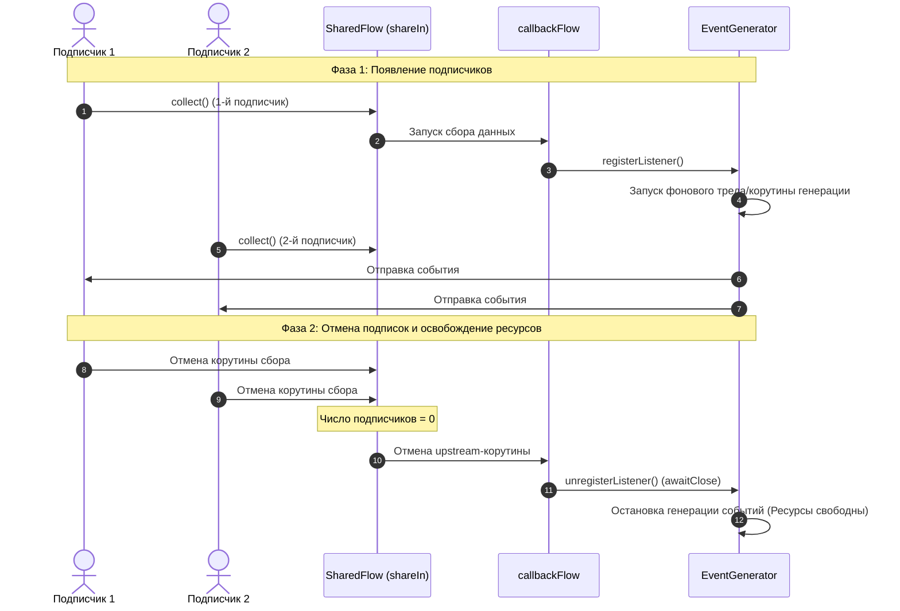

# Управление жизненным циклом реактивных потоков: от Callback API до SharedFlow с автоматической подпиской

В современной разработке под Android и JVM реактивное программирование на основе Kotlin Coroutines и Flow является стандартом. Однако часто приходится иметь дело с традиционными Callback-интерфейсами (слушателями событий) или необходимо распределять один поток данных между несколькими подписчиками с жестким контролем ресурсов.

В этой статье мы подробно разберем, как связать асинхронный генератор событий на основе колбэков, обернуть его в `callbackFlow`, преобразовать в горячий `SharedFlow` с политикой `WhileSubscribed` и управлять подпиской так, чтобы ресурсы выделялись только тогда, когда есть реальные слушатели.

---

## Архитектурная задача

Представим систему, которая генерирует события (например, гео-координаты, сетевые сокеты или показания датчиков). Нам нужно:
1. Обернуть этот источник в поток `Flow`.
2. Сделать так, чтобы несколько подписчиков могли слушать один и тот же поток событий одновременно (**SharedFlow**).
3. Избежать утечек ресурсов: если подписчиков нет (все отписались), генератор событий должен быть полностью остановлен.
4. При повторном подключении подписчиков генератор должен автоматически возобновить работу.

Для реализации этого в Kotlin используются два мощных механизма:
* **`callbackFlow`** — мост между callback-based API и реактивными потоками.
* **`SharingStarted.WhileSubscribed`** — стратегия, управляющая временем жизни горячего потока в зависимости от количества активных коллекторов.

---

## Схема взаимодействия элементов



---

## Полный код реализации

Ниже приведен готовый к запуску пример кода на Kotlin. Для наглядности логов мы используем масштабируемый интервал времени в 10 секунд (в реальном приложении это может быть минута или любой другой промежуток).

```kotlin
import kotlinx.coroutines.*
import kotlinx.coroutines.channels.awaitClose
import kotlinx.coroutines.flow.*
import java.time.LocalTime
import java.time.format.DateTimeFormatter

// Вспомогательный логгер с выводом точного времени
fun log(message: String) {
    val time = LocalTime.now().format(DateTimeFormatter.ofPattern("HH:mm:ss.SSS"))
    println("[$time] $message")
}

// 1. Интерфейс традиционного слушателя событий
interface EventListener {
    fun onEvent(event: String)
}

// 2. Обвязка для генерации событий (Эмуляция внешнего источника)
class EventGenerator(private val scope: CoroutineScope) {
    private val listeners = mutableListOf<EventListener>()
    private var job: Job? = null
    private var eventCounter = 1

    @Synchronized
    fun registerListener(listener: EventListener) {
        listeners.add(listener)
        log("[EventGenerator] Слушатель зарегистрирован. Активных слушателей: ${listeners.size}")
        if (job == null) {
            startGenerating()
        }
    }

    @Synchronized
    fun unregisterListener(listener: EventListener) {
        listeners.remove(listener)
        log("[EventGenerator] Слушатель удален. Активных слушателей: ${listeners.size}")
        if (listeners.isEmpty()) {
            stopGenerating()
        }
    }

    private fun startGenerating() {
        log("[EventGenerator] Запуск фоновой генерации событий...")
        job = scope.launch {
            try {
                while (isActive) {
                    delay(1000) // Генерация события каждую секунду
                    val event = "Event #${eventCounter++}"
                    log("[EventGenerator] Сгенерировано: $event")
                    
                    // Уведомляем зарегистрированных слушателей
                    val currentListeners = synchronized(this@EventGenerator) {
                        ArrayList(listeners)
                    }
                    currentListeners.forEach { it.onEvent(event) }
                }
            } catch (e: CancellationException) {
                log("[EventGenerator] Генерация событий отменена (корутина остановлена).")
            }
        }
    }

    private fun stopGenerating() {
        log("[EventGenerator] Останавливаем генерацию событий (0 слушателей)...")
        job?.cancel()
        job = null
    }
}

// 3. Преобразование Callback API во Flow с помощью callbackFlow
fun eventFlow(eventGenerator: EventGenerator): Flow<String> = callbackFlow {
    log("[callbackFlow] Активация. Подписываемся на EventGenerator...")
    
    val listener = object : EventListener {
        override fun onEvent(event: String) {
            log("[callbackFlow] Получено событие от Generator: $event -> передаем во Flow")
            trySend(event) // Безопасно отправляем событие в поток
        }
    }

    // Регистрируем колбэк
    eventGenerator.registerListener(listener)

    // awaitClose приостанавливает выполнение callbackFlow и ждет закрытия канала.
    // Когда сборщик отменяет подписку, управление переходит сюда.
    awaitClose {
        log("[callbackFlow] Деактивация. Отписываемся от EventGenerator в блоке awaitClose...")
        eventGenerator.unregisterListener(listener)
    }
}

fun main() = runBlocking {
    log("=== ЗАПУСК ДЕМОНСТРАЦИИ FLOW ===")
    
    val DEMO_PERIOD_MS = 10_000L // 10 секунд работы
    log("Период активности подписчиков: ${DEMO_PERIOD_MS / 1000} сек.")

    val generatorScope = CoroutineScope(Dispatchers.Default + SupervisorJob())
    val eventGenerator = EventGenerator(generatorScope)

    // 4. Превращаем callbackFlow в горячий SharedFlow
    val sharedFlow = eventFlow(eventGenerator)
        .shareIn(
            scope = this, // Область видимости для шаринга
            started = SharingStarted.WhileSubscribed(
                stopTimeoutMillis = 0, // Мгновенно останавливать сбор при отсутствии подписчиков
                replayExpirationMillis = 0
            ),
            replay = 0 // Новые подписчики не получают старые события
        )

    // --- ФАЗА 1: Подписка первых слушателей ---
    log("\n--- ФАЗА 1: Подписка подписчиков 1 и 2 ---")
    
    val sub1Job = launch {
        sharedFlow.collect { event ->
            log("    [Подписчик 1] Получил: $event")
        }
    }
    
    delay(500) // Небольшой сдвиг по времени
    
    val sub2Job = launch {
        sharedFlow.collect { event ->
            log("    [Подписчик 2] Получил: $event")
        }
    }

    // Собираем события в течение DEMO_PERIOD_MS
    delay(DEMO_PERIOD_MS)

    // --- ФАЗА 2: Подписчики завершают работу (отписываются) ---
    log("\n--- ФАЗА 2: Отписка подписчиков 1 и 2 ---")
    log("Отменяем работу Подписчика 1...")
    sub1Job.cancel()
    log("Отменяем работу Подписчика 2...")
    sub2Job.cancel()

    // Ожидаем завершения фоновых процессов для наглядности логов
    delay(2000)
    log("\n--- ПЕРИОД ТИШИНЫ: Нет активных подписчиков. Генератор должен молчать. ---")
    delay(DEMO_PERIOD_MS)

    // --- ФАЗА 3: Подписчики снова подписываются спустя время ---
    log("\n--- ФАЗА 3: Повторная подписка подписчиков 1 и 2 ---")
    
    val sub1JobSecond = launch {
        sharedFlow.collect { event ->
            log("    [Подписчик 1 (Переподключен)] Получил: $event")
        }
    }
    
    delay(500)
    
    val sub2JobSecond = launch {
        sharedFlow.collect { event ->
            log("    [Подписчик 2 (Переподключен)] Получил: $event")
        }
    }

    // Собираем события повторно
    delay(DEMO_PERIOD_MS)

    // --- ФИНАЛЬНАЯ ОЧИСТКА ---
    log("\n--- ЗАВЕРШЕНИЕ: Финальная отписка ---")
    sub1JobSecond.cancel()
    sub2JobSecond.cancel()
    
    delay(1000)
    generatorScope.cancel() // Полностью завершаем фоновые ресурсы генератора
    log("=== ДЕМОНСТРАЦИЯ FLOW УСПЕШНО ЗАВЕРШЕНА ===")
}
```

---

## Разбор Жизненного Цикла по Шагам

Запустив этот код, мы увидим детальную трассировку всех внутренних процессов.

### 1. Активация и регистрация (Фаза 1)
Когда первый подписчик вызывает `.collect{}` на нашем `SharedFlow`, политика `SharingStarted.WhileSubscribed` понимает, что количество подписчиков изменилось со `0` на `1`, и немедленно инициирует сбор данных из вышележащего `callbackFlow`.

```text
[15:59:07.533] [callbackFlow] Активация. Подписываемся на EventGenerator...
[15:59:07.535] [EventGenerator] Слушатель зарегистрирован. Активных слушателей: 1
[15:59:07.535] [EventGenerator] Запуск фоновой генерации событий...
```

`callbackFlow` регистрирует свой `EventListener` внутри `EventGenerator`, а тот, обнаружив появление первого слушателя, запускает фоновую генерацию событий раз в секунду.

### 2. Мультивещание (Multicasting)
Каждое событие, отправленное в генератор, перенаправляется в `callbackFlow` через `trySend` и распределяется между подписчиками `SharedFlow`. Оба подписчика получают идентичные сообщения одновременно:

```text
[15:59:08.545] [EventGenerator] Сгенерировано: Event #1
[15:59:08.548] [callbackFlow] Получено событие от Generator: Event #1 -> передаем во Flow
[15:59:08.549]     [Подписчик 1] Получил: Event #1
[15:59:08.550]     [Подписчик 2] Получил: Event #1
```

### 3. Освобождение ресурсов (Фаза 2)
По истечении времени мы отменяем корутины подписчиков. Количество активных слушателей `SharedFlow` падает до `0`.

```text
[15:59:18.038] Отменяем работу Подписчика 1...
[15:59:18.040] Отменяем работу Подписчика 2...
[15:59:18.043] [callbackFlow] Деактивация. Отписываемся от EventGenerator в блоке awaitClose...
[15:59:18.044] [EventGenerator] Слушатель удален. Активных слушателей: 0
[15:59:18.044] [EventGenerator] Останавливаем генерацию событий (0 слушателей)...
[15:59:18.044] [EventGenerator] Генерация событий отменена (корутина остановлена).
```
`WhileSubscribed(stopTimeoutMillis = 0)` мгновенно прекращает сбор данных из `callbackFlow`. Сборщик отменяется, что провоцирует выполнение блока **`awaitClose`** внутри `callbackFlow`. Колбэк безопасно удаляется из `EventGenerator`. Генератор видит `0` слушателей и останавливает свой фоновый поток эмуляции.

### 4. Период тишины
На протяжении периода тишины в консоли не появляется ни одной записи: генерация остановлена, системные ресурсы (процессор, батарея мобильного устройства) находятся в полной безопасности.

### 5. Повторный запуск (Фаза 3)
Когда новые подписчики вновь подключаются к тому же `SharedFlow`, жизненный цикл запускается заново без необходимости пересоздавать поток вручную:

```text
--- ФАЗА 3: Повторная подписка подписчиков 1 и 2 ---
[15:59:30.054] [callbackFlow] Активация. Подписываемся на EventGenerator...
[15:59:30.054] [EventGenerator] Слушатель зарегистрирован. Активных слушателей: 1
[15:59:30.054] [EventGenerator] Запуск фоновой генерации событий...
```
Генератор успешно стартует снова и продолжает выработку событий (начиная с `Event #11`), распределяя их между новыми подписчиками.

---

## Важные особенности проектирования

1. **`SharingStarted.WhileSubscribed`**:
   * Параметр `stopTimeoutMillis` позволяет настроить задержку перед закрытием верхнего потока. Значение `0` означает моментальную остановку. Если выставить, например, `5000` (5 секунд), то кратковременный перезапуск экрана (например, при повороте экрана устройства) не приведет к полной переподписке и остановке генератора. Это крайне полезно при разработке UI под Android.
2. **Безопасность `trySend`**:
   * Внутри `callbackFlow` для передачи данных используется `trySend(event)`. Он возвращает объект результата и не блокирует выполнение, в отличие от приостанавливающего метода `send(event)`. Если буфер канала переполнится, событие будет безопасно отброшено или обработано в соответствии с логикой.
3. **Гарантированная очистка в `awaitClose`**:
   * Блок `awaitClose` выполнится всегда, вне зависимости от того, отменился ли сборщик штатно, упал ли с ошибкой или корутина была принудительно остановлена. Это лучшее место для закрытия сокетов, удаления слушателей, отписки от системных служб.

---

## Заключение

Связка `callbackFlow` + `shareIn` с политикой `WhileSubscribed` предоставляет элегантное и надежное решение для адаптации любых асинхронных Callback-источников данных в реактивную парадигму Kotlin. Она решает проблему утечки ресурсов "из коробки" и обеспечивает бесшовное переиспользование потоков данных между неограниченным числом потребителей.
